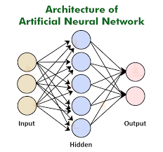
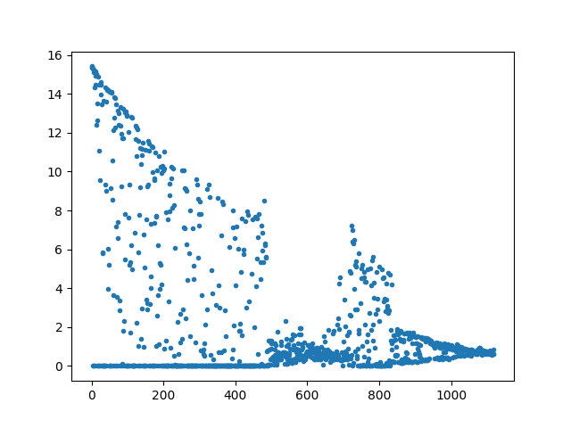

# Binary_Classification_ANN
## Description

A Artificial Neural Network (ANN) project written in Python
### Library used:
- Numpu (randomisation, aggregation)
- pandas (dataframe)
- matplotlib (plot of cost function descends
### Techniques used:
- unibatch
- Sigmoid function (activation function)
- Linear regression form (Y = WX +b)
- hyperparameter tuning (mainly learning rate & number of neurons)
## Source of datasets:
[Wine quality dataset from kaggle](https://www.kaggle.com/nareshbhat/wine-quality-binary-classification) by Naresh Bhat

## Results

### Accuracy: *66.8%*
